# AWS Docusaurus Architecture

This document describes the AWS architecture created by AWS Docusaurus.

## Overview

AWS Docusaurus creates a complete serverless infrastructure for hosting static sites on AWS with enterprise-grade features.


## Components

### 1. Route53 (DNS)

**Purpose**: DNS resolution and routing

- Creates an A record alias pointing to CloudFront
- Uses CloudFront's hosted zone ID (`Z2FDTNDATAQYW2`)
- Supports apex domains and subdomains

```
docs.example.com → CloudFront Distribution
```

### 2. CloudFront (CDN)

**Purpose**: Global content delivery and edge caching

**Features**:
- 400+ edge locations worldwide
- Automatic HTTPS with ACM certificate
- HTTP to HTTPS redirect
- Gzip/Brotli compression
- Custom error pages (SPA support)
- DDoS protection (AWS Shield Standard)

**Configuration**:
```json
{
  "ViewerProtocolPolicy": "redirect-to-https",
  "HttpVersion": "http2",
  "PriceClass": "PriceClass_100",
  "MinimumProtocolVersion": "TLSv1.2_2021"
}
```

### 3. ACM Certificate

**Purpose**: SSL/TLS encryption

- Automatically provisioned in `us-east-1` (CloudFront requirement)
- DNS validation via Route53
- Auto-renewal before expiration
- Supports wildcard domains

### 4. S3 Bucket

**Purpose**: Static file storage

**Security Configuration**:
- **Block Public Access**: All 4 settings enabled
- **Bucket Policy**: OAI-only access
- **Encryption**: AES-256 (default)

```json
{
  "BlockPublicAcls": true,
  "IgnorePublicAcls": true,
  "BlockPublicPolicy": true,
  "RestrictPublicBuckets": true
}
```

### 5. Origin Access Identity (OAI)

**Purpose**: Secure S3 access from CloudFront

- CloudFront uses OAI to access S3
- S3 bucket policy allows only OAI principal
- Direct S3 URL access is blocked

### 6. Lambda@Edge (Optional)

**Purpose**: Basic Authentication

- Runs at CloudFront edge locations
- Intercepts viewer requests
- Returns 401 if credentials invalid
- Minimal latency impact (~1-5ms)

**Deployment Region**: `us-east-1` (required for Lambda@Edge)

## Data Flow


### Request Flow

```
1. User requests https://docs.example.com
2. DNS resolves to CloudFront edge
3. CloudFront checks cache
   - HIT: Return cached content
   - MISS: Continue to origin
4. Lambda@Edge validates auth (if enabled)
5. CloudFront fetches from S3 via OAI
6. Response cached at edge
7. Content delivered to user
```

### Deployment Flow

```
1. Developer runs /aws-docusaurus deploy
2. Site built locally (npm run build)
3. Static assets uploaded to S3 (1-year cache)
4. HTML files uploaded to S3 (no cache)
5. CloudFront cache invalidated
6. New content available globally in 1-5 minutes
```

## Security Architecture

```mermaid
flowchart TB
    subgraph L1["🛡️ Layer 1: DDoS Protection"]
        Shield["AWS Shield"]
    end

    subgraph L2["🔐 Layer 2: Transport Security"]
        TLS["CloudFront HTTPS<br/>TLS 1.2+"]
    end

    subgraph L3["🔑 Layer 3: Authentication"]
        Auth["Lambda@Edge<br/>Basic Auth"]
    end

    subgraph L4["📋 Layer 4: Access Control"]
        OAI["S3 Bucket Policy<br/>OAI Only"]
    end

    subgraph L5["🚫 Layer 5: Public Access Block"]
        Block["S3 Block Public Access<br/>All options enabled"]
    end

    L1 --> L2 --> L3 --> L4 --> L5
```



## Cache Architecture

### Cache Layers

1. **Browser Cache**: Controlled by Cache-Control headers
2. **CloudFront Edge Cache**: Regional edge caches
3. **CloudFront Regional Cache**: Intermediate caching layer

### Cache Invalidation

```bash
# Invalidate specific paths
aws cloudfront create-invalidation \
  --distribution-id E1234 \
  --paths "/index.html" "/docs/*"

# Invalidate everything
aws cloudfront create-invalidation \
  --distribution-id E1234 \
  --paths "/*"
```

**Cost**: First 1,000 invalidation paths/month free, then $0.005/path

## High Availability

- **S3**: 99.999999999% durability (11 nines)
- **CloudFront**: 99.9% SLA
- **Route53**: 100% SLA
- **Global**: Content served from nearest edge location

## Disaster Recovery

### Backup Strategy

1. **S3**: Enable versioning for rollback capability
2. **Infrastructure**: All resources can be recreated via AWS Docusaurus
3. **DNS**: Route53 hosted zone should be documented

### Recovery Procedures

```bash
# Rollback to previous version (if versioning enabled)
aws s3api list-object-versions --bucket my-site --prefix index.html

# Restore specific version
aws s3api copy-object \
  --bucket my-site \
  --key index.html \
  --copy-source "my-site/index.html?versionId=xxx"
```

## Cost Optimization

### Recommendations

1. **PriceClass_100**: Uses only NA/EU edges (cheapest)
2. **Compression**: Reduces transfer costs by 60-80%
3. **Caching**: Higher cache hit ratio = lower origin costs
4. **Invalidations**: Batch changes to minimize invalidations

### Monitoring Costs

```bash
aws ce get-cost-and-usage \
  --time-period Start=2024-01-01,End=2024-01-31 \
  --granularity MONTHLY \
  --metrics BlendedCost \
  --group-by Type=DIMENSION,Key=SERVICE
```

## Scaling

AWS Docusaurus architecture scales automatically:

| Load | CloudFront | S3 | Lambda@Edge |
|------|------------|----|----|
| 100 req/s | Auto | Auto | Auto |
| 10,000 req/s | Auto | Auto | Auto |
| 1,000,000 req/s | Auto | Auto | Auto |

No configuration changes needed for any traffic level.
